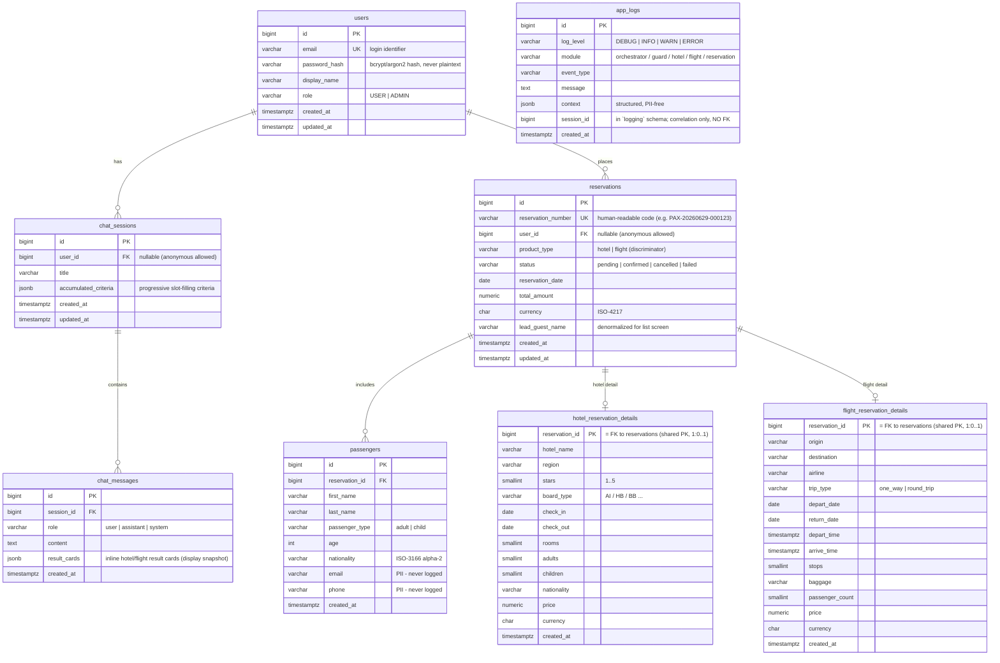

# PaxAssist — Database ER Diagram

This document is the **persisted PostgreSQL data model** for PaxAssist (SAN TSG AI Chatbot).
It is the single source of truth that the Flyway migration
[`backend/src/main/resources/db/migration/V1__initial_schema.sql`](../backend/src/main/resources/db/migration/V1__initial_schema.sql)
implements and that the JPA entities (`ddl-auto: validate`) will be validated against.

**Scope.** Only data that is **persisted in PostgreSQL** is modeled here. TourVisio hotel/flight
**products** and the progressively slot-filled **search criteria** are transient — they live in the
Redis cache and in the chat session's `accumulated_criteria` JSONB — so they are **not tables**.
Only the **final booked product snapshot** is stored, inside the two reservation-detail tables.

---

## Entity-Relationship Diagram

---

## Logical groups

The architecture (`docs/architecture.md`) describes three logical data stores inside the single
physical `paxassist` database:

| Logical store | Tables |
|---|---|
| **Chat & Session DB** | `chat_sessions`, `chat_messages` |
| **Reservation DB** | `reservations`, `passengers`, `hotel_reservation_details`, `flight_reservation_details` |
| **Log DB** | `logging.app_logs` (separate `logging` schema) |
| **Shared** | `users` |

Chat & Session and Reservation tables live in the `public` schema; the Log DB is isolated in a
dedicated **`logging`** schema. `app_logs` therefore has **no relationship edge** in the diagram
(its `session_id` is a loose correlation value, not a foreign key).

Live TourVisio search results are cached in **Redis**, not in any of these tables.

---

## Tables

- **`users`** — application user with authentication. `email` is the unique login identifier,
  `password_hash` stores a bcrypt/argon2 hash (never plaintext — produced by the Spring Security
  `PasswordEncoder`), `role` drives authorization.
- **`chat_sessions`** — one chatbot conversation. `accumulated_criteria` (JSONB) holds the
  progressively slot-filled hotel/flight search criteria; it is transient working state, hence not
  normalized into its own tables.
- **`chat_messages`** — append-only conversation transcript, one row per `user` / `assistant` /
  `system` turn. `result_cards` (JSONB) stores the hotel/flight cards rendered inline in the thread.
- **`reservations`** — the reservation header and the row backing the reservation-list screen.
  `reservation_number` is the human-readable code shown in the UI; the `bigint` PK stays internal.
  `product_type` discriminates which detail table holds the booked snapshot.
- **`passengers`** — the guest/passenger people attached to a reservation (1:N). Contact fields are
  PII and must never be written to logs.
- **`hotel_reservation_details`** / **`flight_reservation_details`** — 1:0..1 snapshots of the booked
  product and stay/itinerary parameters. Each uses a **shared primary key** (`reservation_id` is both
  PK and FK to `reservations`), which structurally guarantees at most one detail row per reservation.
- **`logging.app_logs`** — asynchronous system & error logs (PII-free), isolated in the separate
  `logging` schema. `session_id` is a loose correlation column with **no foreign key** to
  `chat_sessions`: logs are written asynchronously and must survive after a session is deleted.

---

## Design decisions

- **Surrogate keys:** `BIGINT GENERATED ALWAYS AS IDENTITY` on every table (not UUID). This is a
  single, internal database with no sharding or offline ID generation; BIGINT gives smaller indexes
  and better write locality on the high-volume tables (`chat_messages`, `app_logs`). The only value
  exposed externally is `reservations.reservation_number`, a separate human-readable code.
- **Enums as `VARCHAR` + `CHECK`:** portable, Flyway/Hibernate-friendly (maps cleanly to
  `@Enumerated(EnumType.STRING)`), and easy to extend in a later migration — preferred over native
  PostgreSQL `ENUM` types.
- **Subtype tables for booked products:** hotel and flight snapshots have largely non-overlapping
  columns, so two thin 1:0..1 subtype tables keep each shape type-safe, rather than a half-null
  polymorphic table or an opaque JSONB blob.
- **JSONB for transient/flexible data:** `accumulated_criteria` and `result_cards` are schema-flexible
  display/working state, so JSONB is a better fit than rigid columns.
- **Nullable ownership:** `chat_sessions.user_id` and `reservations.user_id` are nullable with
  `ON DELETE SET NULL`, so anonymous/unauthenticated use is possible and deleting a user never
  destroys reservation history.
- **Cascade rules:** child rows that cannot exist without their parent (`chat_messages`, `passengers`,
  the two detail tables) use `ON DELETE CASCADE`; the loose `reservations.user_id` link uses
  `ON DELETE SET NULL`.
- **Log isolation:** `app_logs` lives in a separate `logging` schema and carries **no foreign key**
  to `chat_sessions`. This honours the architecture's distinct "Log DB" store, keeps high-volume
  append-only logs out of the operational tables, and lets logs be written asynchronously and survive
  session deletion. `session_id` is kept only as a correlation value.
- **Types:** money is `numeric(12,2)` always paired with a `char(3)` ISO-4217 `currency`; stay/flight
  calendar dates use `date`; all instants (including flight depart/arrive times) use `timestamptz`.
- **`lead_guest_name`** on `reservations` is a deliberate denormalization so the reservation-list
  screen renders without joining `passengers`; the canonical passenger data still lives in `passengers`.

---

## Relationships

| Relationship | Cardinality | Notes |
|---|---|---|
| `users` → `chat_sessions` | 1 : N | optional parent (`user_id` nullable) |
| `users` → `reservations` | 1 : N | optional parent (anonymous allowed) |
| `chat_sessions` → `chat_messages` | 1 : N | append-only transcript |
| `reservations` → `passengers` | 1 : N | |
| `reservations` → `hotel_reservation_details` | 1 : 0..1 | present iff `product_type = 'hotel'` |
| `reservations` → `flight_reservation_details` | 1 : 0..1 | present iff `product_type = 'flight'` |

The `product_type` ↔ detail-table consistency is enforced at the application layer (the service
inserts the matching detail row); a DB-level trigger would be over-engineering for this MVP.

`logging.app_logs` has no relationship in this list by design — it sits in the isolated `logging`
schema and references no operational table.

---

## Out of scope (by design)

- TourVisio `hotel_products` / `flight_products` and `search_criteria` tables — transient data kept in
  Redis / the `accumulated_criteria` JSONB.
- Login/register endpoints, JWT/session issuance and Spring Security wiring — this document covers the
  schema only; `users` carries the auth columns, but the auth flow code is a later step.
- Soft-delete and payment/credit-card data (the chatbot never takes payment, per the security rules).
