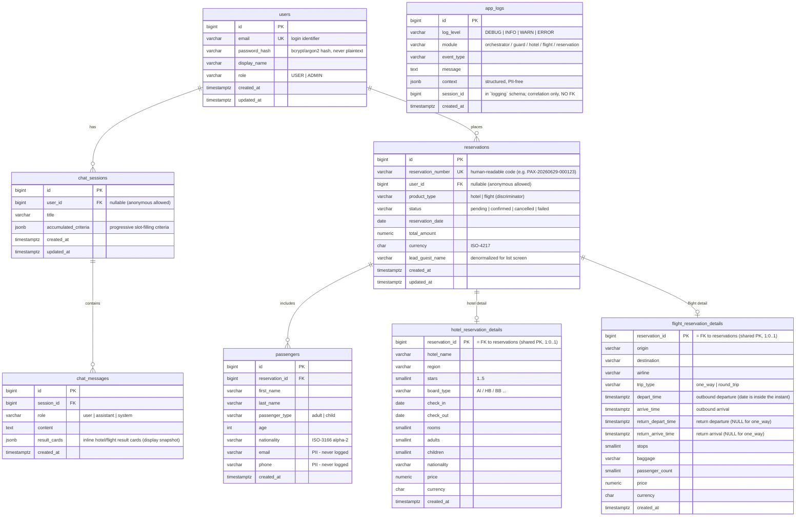

# PaxAssist Sistem Dokümantasyonu

Bu doküman, PaxAssist chatbot projesinin teknik altyapısını, mimarisini ve bileşenlerini detaylandırmaktadır.
## 1. Kullanılan Teknolojiler ve Versiyonlar

### 1.1. Backend (Sunucu Tarafı)
- **Dil:** Java 21
- **Framework:** Spring Boot 3
- **Veritabanı:** PostgreSQL (16-alpine) ve H2 (Yük testleri için in-memory)
- **Önbellek & Rate Limiting:** Redis (7.2-alpine)
- **Yapay Zeka (AI) Entegrasyonu:** Spring AI 1.0.0 (Ollama ve OpenAI/Gemini destekli)
- **Güvenlik:** Spring Security, JSON Web Token (JJWT 0.12.6)
- **ORM & Veritabanı Yönetimi:** Spring Data JPA

### 1.2. Frontend (Kullanıcı Arayüzü)
- **Kütüphane:** React 18.3.1
- **Dil:** TypeScript (~5.6.2)
- **Derleyici & Sunucu:** Vite 5.4.10
- **Durum Yönetimi:** Redux Toolkit, React Query (TanStack Query)
- **Stil & Tasarım:** TailwindCSS, Framer Motion, Radix UI bileşenleri, lucide-react
- **Form & Validasyon:** React Hook Form, Zod
- **Yönlendirme:** React Router DOM
- **HTTP İstemcisi:** Axios

### 1.3. Devops & Altyapı
- **Konteynerizasyon:** Docker, Docker Compose
- **Test:** Vitest, JUnit Jupiter
---

## 2. Mimari Düzen

Sistem, **Modüler Monolit (Modular Monolith)** mimari yaklaşımı ile tasarlanmıştır.

Bu yaklaşım sayesinde kod tabanı mantıksal olarak birbirinden ayrılmış bağımsız modüllere bölünmüştür. Her modül kendi iş mantığını, DTO'larını ve servislerini içerir. Ancak tüm modüller tek bir uygulama olarak deploy edilir. Bu durum, mikroservislerin karmaşıklığından kaçınırken sistemin gelecekte kolayca mikroservislere bölünebilmesine olanak tanır.

**Temel Modüller:**
- `auth`: Kullanıcı kimlik doğrulama, JWT yönetimi ve oturum işlemleri.
- `chat`: Chatbot oturumları ve mesaj yönetimi.
- `flight`: Uçuş aramaları ve uçuşa özgü iş süreçleri.
- `hotel`: Otel aramaları ve otel işlemleri.
- `reservation`: Rezervasyon onaylama, iptal ve önizleme süreçleri.
- `orchestrator`: AI destekli sohbet akışının yönetildiği ana karar merkezi.
- `ratelimiter`: Redis kullanarak API istek limitlerinin kontrolü.
- `validator` & `guard`: Veri doğrulama ve AI çıktılarının kontrolü.

---

## 3. Kullanılan Design Pattern'lar (Tasarım Desenleri)

1. **Orchestrator Pattern (Orkestratör Deseni):** 
   - Sistemde AI yanıtlarını ve kullanıcı intent (niyet) analizlerini yönetmek için `ChatOrchestrationService` sınıfı kullanılmaktadır. Sohbet süreci tek bir merkezden organize edilir.
2. **MVC (Model-View-Controller):**
   - İstemci ile iletişim Controller sınıfları (örn: `ChatController`, `AuthController`) üzerinden sağlanır, Controller'lar sadece ince bir HTTP katmanı görevi görür.
3. **Repository Pattern:**
   - Spring Data JPA aracılığıyla veritabanı işlemleri soyutlanmıştır.
4. **DTO Mapper Pattern:**
   - Domain modellerinin HTTP katmanına sızmasını önlemek için ilgili yapılar bulunur.
---

## 4. Sistem Mimari Diyagramı (Mermaid)

Sistemin modüler yapısı ve bileşenler arası iletişim diyagramı:

```mermaid
graph TD
    %% =====================================================================
    %% PaxAssist — Kanonik Mimari (Modular Monolith)
    %% Değişiklik günlüğü (docs revizyonu):
    %%  - Guard artık Orchestrator'ın İLK iç adımı (LLM öncesi fail-fast); eski "gateway
    %%    öncesi mi / alt-adım mı" çelişkisi minimal-architecture.md ile hizalandı.
    %%  - JWT Auth katmanı + paylaşılan users tablosu eklendi (kod gerçeğini yansıtır).
    %%  - Rate limiter "kimliği doğrulanmış principal'a göre anahtarlar" notu eklendi.
    %%  - Orchestrator'a Evaluator-Optimizer (AI serbest-metin çıktısında guardrail döngüsü) eklendi.
    %%  - Runtime MCP Server (arama araçlarını yayınlar) eklendi — dev-time MCP'lerden farklıdır.
    %%  - Log Modülü + LogDB kanonik kabul edildi; "planlanan vs. bugünkü" notu düşüldü.
    %%  - Reservation "planlanan" olarak işaretlendi.
    %% =====================================================================
    %% --- STİL VE RENK TANIMLAMALARI ---
    classDef client fill:#eceff1,stroke:#37474f,stroke-width:2px;
    classDef gateway fill:#e3f2fd,stroke:#1565c0,stroke-width:2px;
    classDef orchestrator fill:#bbdefb,stroke:#0d47a1,stroke-width:2px;
    classDef business fill:#fff3e0,stroke:#ef6c00,stroke-width:2px;
    classDef cache fill:#ffe0b2,stroke:#f57c00,stroke-width:2px;
    classDef db fill:#e8f5e9,stroke:#2e7d32,stroke-width:2px;
    classDef ext fill:#ffebee,stroke:#c62828,stroke-width:2px;
    classDef log fill:#f1f8e9,stroke:#558b2f,stroke-width:2px;
    classDef mcp fill:#ede7f6,stroke:#4527a0,stroke-width:2px;

    %% --- AKTÖRLER VE İSTEMCİLER ---
    User((Kullanıcı / Browser)):::client
    McpClient((Harici MCP Client <br> ör. Claude Desktop)):::client

    %% --- MODULAR MONOLITH SINIRI ---
    subgraph Modular_Monolith_Boundary [Modular Monolith Uygulama Sınırı]

        %% Giriş ve Güvenlik Katmanı
        RateLimiter[1. Rate Limiter <br> İstek sınırlandırma · kimliği doğrulanmış principal'a göre anahtarlar]:::gateway
        JwtAuth[2. JWT Auth Filtresi <br> Stateless Bearer · Spring Security]:::gateway

        %% Ana Yönetici + İç Adımlar
        Orchestrator[3. Chat Orchestrator <br> İnce koordinatör: guard → intent → route → persist]:::orchestrator
        Guard[3a. Guard <br> Orchestrator'ın İLK adımı · Regex / Prompt Injection / Küfür · LLM öncesi fail-fast]:::gateway
        AI_Engine[4. AI / Intention <br> Niyet analizi + slot çıkarımı]:::orchestrator
        Evaluator[4a. Evaluator-Optimizer <br> AI serbest-metninde üret→değerlendir→iyileştir · guardrail zorlaması]:::orchestrator

        %% İş Mantığı Modülleri
        subgraph Business_Modules [İş Mantığı Modülleri]
            HotelMod[Hotel Modülü]:::business
            FlightMod[Flight Modülü]:::business
            ReservationMod[Reservation Modülü <br> PLANLANAN · 0-token AI-dışı form]:::business
        end

        %% Önbellek + MCP + Log
        RedisCache[Redis Cache <br> TourVisio canlı sonuçları]:::cache
        McpServer[MCP Server -runtime- <br> Arama araçlarını yayınlar · SEARCH-ONLY, booking YOK]:::mcp
        LogMod[Log Modülü <br> Asenkron kuyruk · PLANLANAN <br> -bugün: harici log servisi + SLF4J audit-]:::log
    end

    %% --- VERİTABANI KATMANI ---
    subgraph Storage_Layer [Kalıcı Veri Katmanı]
        UsersDB[(users <br> Paylaşılan kimlik + rol)]:::db
        ChatDB[(Chat & Session DB <br> chat_sessions / chat_messages)]:::db
        ResDB[(Reservation DB <br> Nihai rezervasyon kayıtları)]:::db
        LogDB[(logging.app_logs <br> Sistem ve hata logları)]:::db
    end

    %% --- DIŞ DÜNYA ---
    TourVisio((TourVisio API <br> Canlı entegrasyon)):::ext

    %% =======================================================
    %% 1. Güvenlik ve giriş akışı
    User -->|1. Doğal dilde mesaj| RateLimiter
    RateLimiter -->|2. Limit aşılmadıysa| JwtAuth
    JwtAuth -->|3. Kimlik doğrulandı| Orchestrator
    JwtAuth -.->|Kullanıcı/rol doğrula| UsersDB

    %% 2. Orchestrator iç akışı
    Orchestrator -->|3a. İLK adım: girişi denetle| Guard
    Guard -.->|Zararlı içerik → güvenli reddet yanıtı| User
    Orchestrator -->|4. Niyet + slot çıkar| AI_Engine
    AI_Engine -.->|Intent + çıkarılan kriterler| Orchestrator
    Orchestrator -->|4a. AI serbest-metin çıktısını denetle| Evaluator
    Orchestrator -->|Her mesajda durumu kaydet| ChatDB

    %% 3. Ürün arama ve önbellek
    Orchestrator -->|Otel arama| HotelMod
    Orchestrator -->|Uçuş arama| FlightMod
    HotelMod -->|Önbellekte var mı?| RedisCache
    FlightMod -->|Önbellekte var mı?| RedisCache
    HotelMod -->|Cache miss: canlı veri| TourVisio
    FlightMod -->|Cache miss: canlı veri| TourVisio
    HotelMod -.->|Filtrelenmiş sonuç kartları| Orchestrator
    FlightMod -.->|Filtrelenmiş sonuç kartları| Orchestrator
    Orchestrator -.->|Cevap + kartlar| User

    %% 4. Rezervasyon akışı (AI devre dışı, geleneksel form)
    User -->|Ürünü seç + formu doldur · 0 token güvenli alan| ReservationMod
    ReservationMod -->|Rezervasyonu tamamla / koltuk-oda bağla| TourVisio
    ReservationMod -->|Başarılı rezervasyonu kaydet| ResDB

    %% 5. MCP -runtime- arama araçlarını dışarı açar
    McpClient -->|MCP protokolü · JWT güvenliği arkasında| McpServer
    McpServer -->|Arama use-case'i| HotelMod
    McpServer -->|Arama use-case'i| FlightMod

    %% 6. Arka planda asenkron loglama (planlanan)
    Orchestrator -.->|Log olayı| LogMod
    HotelMod -.->|Log olayı| LogMod
    FlightMod -.->|Log olayı| LogMod
    ReservationMod -.->|Log olayı| LogMod
    LogMod -->|Background worker ile toplu yazma| LogDB
```

---

## 5. ER (Entity-Relationship) Diyagramı

Veritabanı varlıkları arasındaki temel ilişkiler:

---

## 6. API Dokümantasyonu (Özet)

**Base URL:** `/api/v1`

### 6.1. Auth API (`/auth`)
- **POST `/register`**: Yeni kullanıcı kaydı.
- **POST `/login`**: Kullanıcı girişi ve JWT token alınması.
- **POST `/refresh`**: Süresi dolmuş Access Token'ın Refresh Token ile yenilenmesi.
- **POST `/logout`**: Mevcut oturumun kapatılması ve token iptali.
- **GET `/me`**: Oturum açmış kullanıcı bilgilerinin getirilmesi.
- **POST `/reset-password`**: Şifre sıfırlama işlemi.

### 6.2. Chat API (`/chat`)
- **POST `/`**: Chatbot'a mesaj gönderme ve AI'dan cevap alma işlemi. (Yetkilendirilmiş kullanıcılar veya `X-Guest-Id` başlığı ile anonim kullanıcılar).
- **GET `/sessions`**: Kullanıcıya veya Guest'e ait geçmiş sohbet oturumlarının özetini listeler.
- **GET `/{sessionId}`**: Belirli bir sohbetin detayını getirir.
- **DELETE `/{sessionId}`**: İlgili sohbeti siler.

### 6.3. Reservation API (`/reservations`)
- **POST `/preview`**: Rezervasyon yapılmadan önce ürünün uygunluğunu ve fiyatını (TourVisio üzerinden) kontrol eder ve dondurur.
- **POST `/`**: Dondurulmuş önizlemeyi onaylar ve satın almayı gerçekleştirir.
- **GET `/`**: Kullanıcının geçmiş ve aktif rezervasyonlarını listeler.
- **GET `/{id}`**: Rezervasyon detayını getirir.
- **PATCH `/{id}/cancel`**: Aktif bir rezervasyonu iptal eder.

### 6.4. Admin API (`/admin`)
- **GET `/dashboard/stats`**: Sistem istatistiklerini getirir (Toplam rezervasyon, gelir, aktif kullanıcı).
- **GET `/users`**: Sistemdeki kullanıcıları listeler.
- **GET `/reservations`**: Sistemdeki tüm rezervasyonları listeler.
- **PUT `/reservations/{id}/status`**: Admin yetkisiyle rezervasyon iptali sağlar.

API dokümanı daha detaylı olarak `api-docs.md` dosyasinda mevcuttur.
---

## 7. Notlar

1. **İleri Seviye AI Entegrasyonu:** Sistemin kalbi Spring AI ile inşa edilmiştir. İstemci ile iletişim sırasında birden fazla LLM (OpenAI/Gemini ve Ollama) kullanılarak hem yüksek performanslı yanıtlar üretilir hem de veri gizliliği veya hız odaklı model değişimleri kolayca yapılabilir.
2. **Dağıtık Rate Limiting Altyapısı:** Redis kullanarak, sunucuların aşırı yüklenmesini önlemek ve DDOS saldırılarına karşı API'leri korumak için rate-limit yapısı kurulmuştur. Ayrıca API isteklerini azaltmak için API'den gelen yanıtları depolayarak performans artışı sağlanmıştır.
3. **Bağımlılıkların Kolay Yönetimi (Dockerized):** Tüm altyapı (PostgreSQL, Redis, Ollama ve uygulamanın kendisi) `docker-compose` ile tek bir komutla (`docker-compose up`) ayağa kalkacak şekilde izole edilmiştir.
4. **Modern Frontend Mimarisi:** İstemci tarafında React, TypeScript ve Vite ekosistemi kurularak performanstan ödün verilmemiş, Framer Motion ve TailwindCSS ile çok akıcı bir kullanıcı deneyimi hedeflenmiştir.
5. **Dayanıklılık (Resilience):** Modüler Monolit tasarım sayesinde hata yönetimi merkezileştirilmiş (`GlobalExceptionHandler`, vb.) ve 3. parti API'lere (TourVisio vb.) yapılan hatalı isteklerde açık ve net hata mesajları (örneğin fiyat değişikliği senaryoları `PRICE_MISMATCH` gibi 409 Conflict mesajlarıyla) kullanıcılara yansıtılmıştır.
